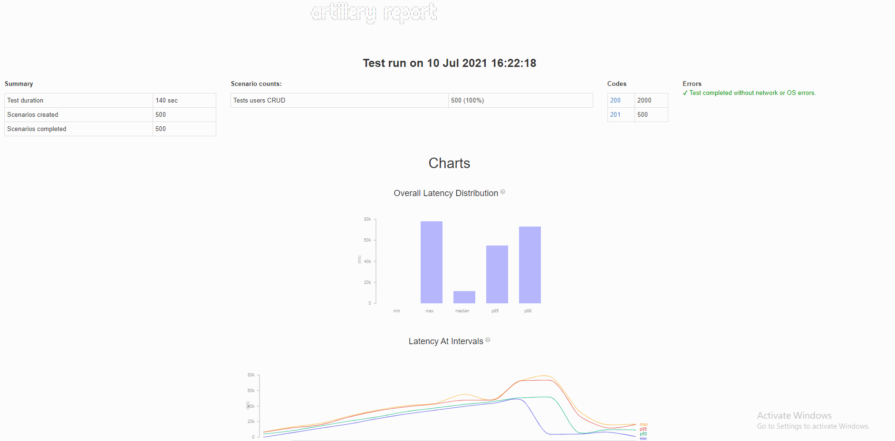

# RS School REST service

## Load testing

Для производительность Nest.js с использованием express и fastify использован artillery.

Файл конфигурации:
```
./artillery-config.test.yaml
```
Взят модуль Users и теструются все CRUD методы ресурса.
В тестирование происходят последовательные дейстия 
    
    1. Создание юзера
    2. Обновление юзера
    3. Получение юзера по id
    4. Получение всею юзеров
    5. Удаление созданного юзера
  
(В тестах гененируется 10 юзеров каждую секунда на протяжении 50 сеунд)    

### report-fastify


### report-expres



## Prerequisites

- Git - [Download & Install Git](https://git-scm.com/downloads).
- Node.js - [Download & Install Node.js](https://nodejs.org/en/download/) and the npm package manager.

## Downloading

```
git clone {repository URL}
```

## Installing NPM modules

```
npm install
```

## Running application

```
npm start
```

After starting the app on port (4000 as default) you can open
in your browser OpenAPI documentation by typing http://localhost:4000/doc/.
For more information about OpenAPI/Swagger please visit https://swagger.io/.

## Running application with Docker [ru]
##### Для запуска приложения в корневой папке необходимо запустить команду 
```
docker-compose up
```
Все необходимые images скачиваются из репозитория размещены на Docker Hub https://hub.docker.com/repository/docker/alexdv/task6


Все Images сделаны на основе Dockerfile файлов.
- Для Node при приложения ./Dockerfile
- Для DB  ./src/common/Dockerfile

##### Сканирования уязвимостей
- Для сканирования image node приложения запустить команду
````
npm run scan-node
````

- Для сканирования image node приложения запустить команду
````
npm run scan-db
````

## Testing

After application running open new terminal and enter:

To run all tests without authorization

```
npm test
```

To run only one of all test suites (users, boards or tasks)

```
npm test <suite name>
```

To run all test with authorization

```
npm run test:auth
```

To run only specific test suite with authorization (users, boards or tasks)

```
npm run test:auth <suite name>
```

## Development

If you're using VSCode, you can get a better developer experience from integration with [ESLint](https://marketplace.visualstudio.com/items?itemName=dbaeumer.vscode-eslint) and [Prettier](https://marketplace.visualstudio.com/items?itemName=esbenp.prettier-vscode) extensions.

### Auto-fix and format

```
npm run lint
```

### Debugging in VSCode

Press <kbd>F5</kbd> to debug.

For more information, visit: https://code.visualstudio.com/docs/editor/debugging
